# 1. Motivation of Boosting

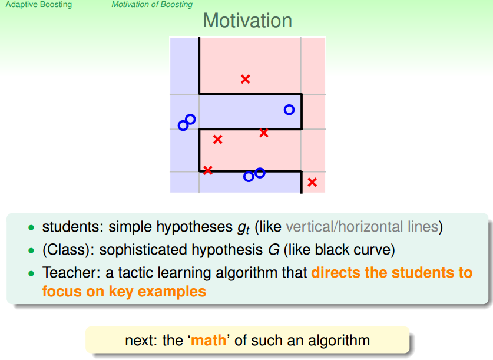

本节主要通过一个例子：一个班级的学生在老师的提示下，学习辨别苹果的方法。

* 学生：就好比于一些比较简单的hypothesis
* 班级：表示复杂的hypothesis G
* 老师：引导学生关注关键样本的策略学习算法

# 2. Diversity by Re-weighting

## 2.1 Bootstrapping as Re-weighting Process

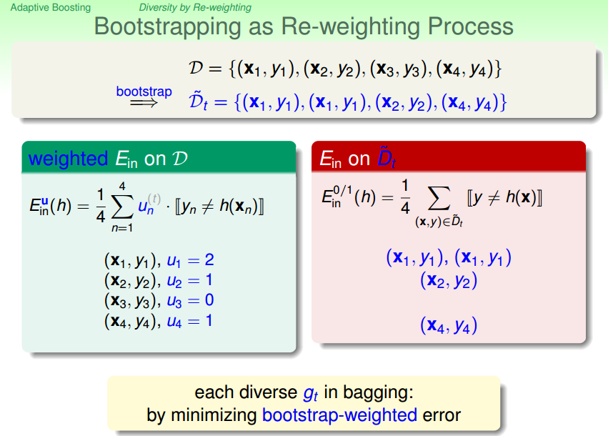

从上图可以看出，通过bootstrapping后的资料的Ein相当于Re-weighting的资料的Ein。

我们以Un来记录每一轮某笔资料的数量，我们可以从另一个方面来考虑bagging，他在尝试着最小化bootstrap-weighted error。

## 2.2 Weighted Base Algorithm

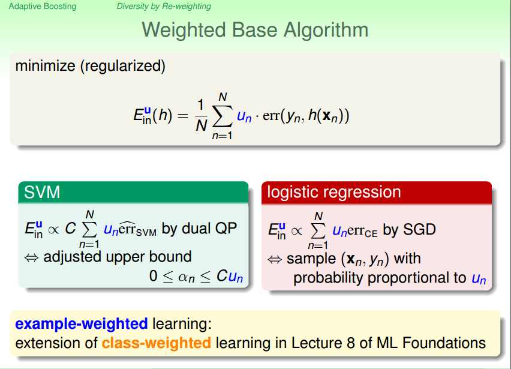

上图介绍了一种weighted error的方法，并介绍了如何将这种方法嵌入到SVM以及使用SGD的logistics regression中。所以说我们也很容易将这种weighted error的思维嵌入到我们的aggregation中的base algorithm中。

## 2.3 Re-weighting for more Diversity Hypothesis

既然我们的bagging可以看成是一个使用weighted error base algorithm的模型，那我们可以采用什么方法来改进我们的bagging，我们之前在介绍aggregation说过，gt越不一样对于我们做aggregation越有利。所以我们就想办法来让bagging产生更多diversity的gt。

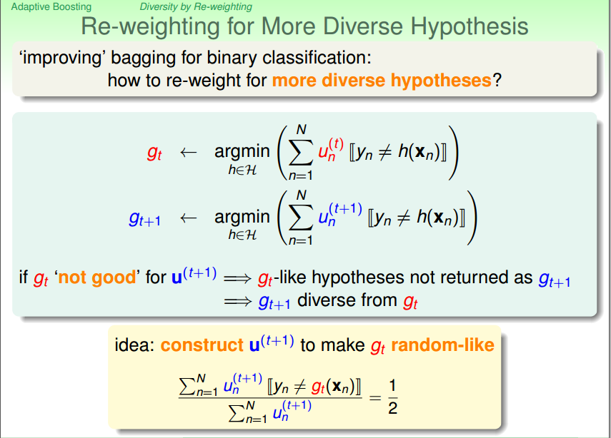

如果我们做一件事情，选择一个小的Ut+1，使我们的gt（已经学习到的）在这个Ut+1上表现（那这个Ut+1权重的资料在gt上测试）的非常不好。然后我们根据这个Ut+1学习到一个gt+1，那我们可以说gt和gt+1肯定是不同的。

那如何来衡量gt在Ut+1上表现的不好呢？如果我们让gt在Ut+1上的测试结果和丢硬币的结果差不多（正确率百分之50，相当于猜），那么gt就可以说表现得很不好，所以我们接下来要做的意见事情就是找到一个Ut+1使gt在其上面的测试的正确率为百分之五十。

## 2.4 Optimal Re-weighting

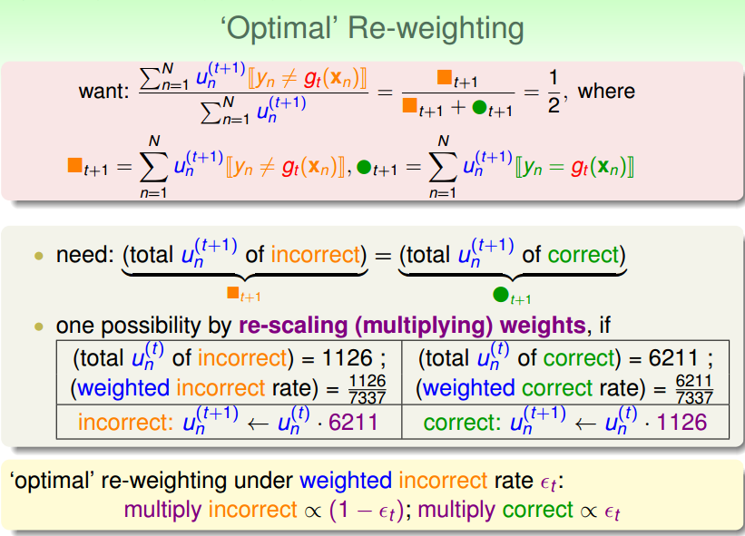

上面就是一个如何根据Ut来计算Ut+1的例子，该例子说明了只要新的Ut+1内正确的分数(所有正确的样本和他们的权重的乘积的和)和错误的分数(所有错误的样本和他们的权重的乘积的和)相等的话，那么gt在新的Ut+1上的表现就非常的差。所以我们可以根据老的Ut来计算新的Ut+1，而不是像bagging那样每一轮的Ut都是通过抽样来决定。

# 3. Adaptive Boosting Algorithm

## 3.1 Scaling Factor

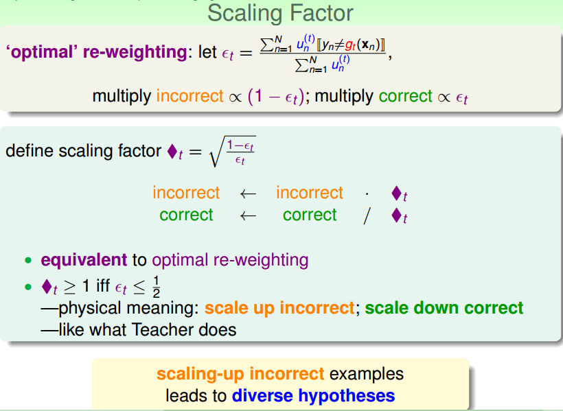

我们在上一节已经告知了如何通过Ut来得到Ut+t，现在提供一个更具有直观意义的参数-缩放因子来计算Ut+1。（错误率小于1/2，这是对算法的基本要求）因为错误的样本需要被放大，所以需要用Ut中错误样本的系数来乘以◇t。反之正确样本需要被缩小，那就要用Ut正确样本的系数除以◇t。

## 3.2 A Preliminary Algorithm

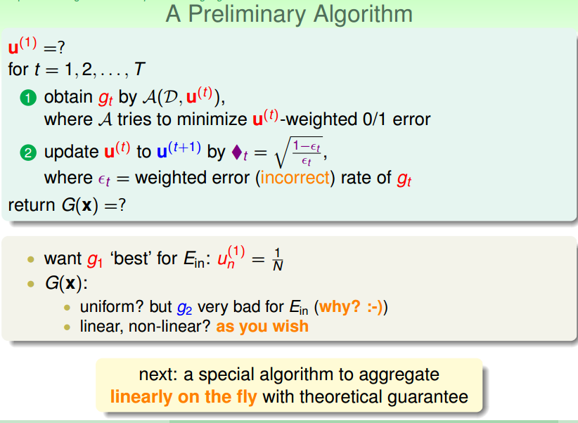

所以我们现在有了一个初步的算法的长相，那现在来看一下我们还缺什么？

* 一开始的U是多少？为了让g1在Ein上表现的好，我们设置Ein:un(1) = 1/N
* 最后的G（x）怎么来呢？用uniform好不好，不行？g1和g2很不同，g1在Ein表现好，那g2在Ein上表现肯定就不好。所以不能用平均投票的思路。那可不可以用linear或者any的思路呢？也许吧！下面会介绍一个边学习gt边决定at的办法。

## 3.3 Linear Aggregation on the fly

下面就通过一种方法来实现如何在学习gt的同时决定at。

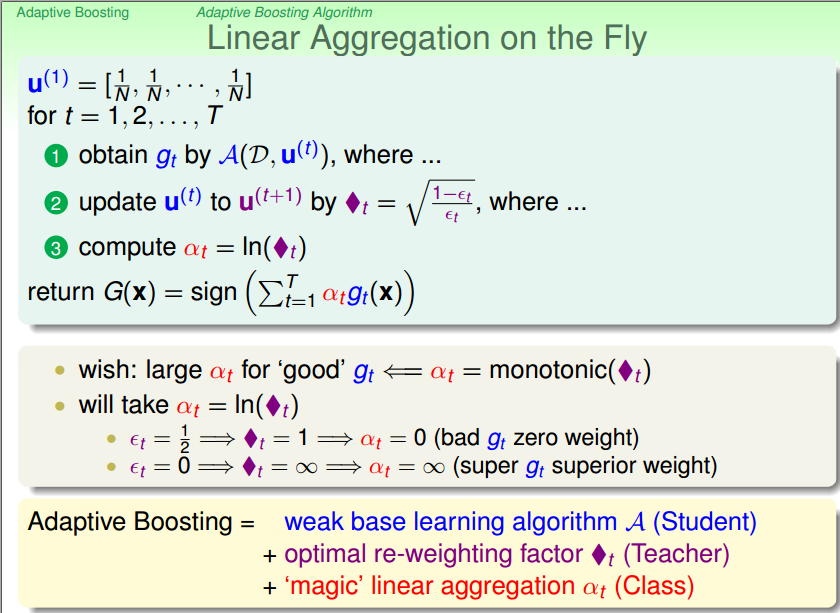

对于错误率较小的gt，我们肯定想要比较大的at，错误率小对应◇t大，所以at应该正比于◇t。设计这个演算法的人使用了at = ln(◇t)。

## 3.4 Adaptive Boosting(AdaBoost) Algorithm

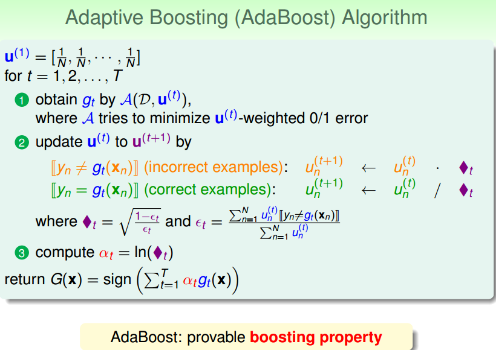

所以我们算法大概长这个样子。

## 3.5 AdaBoost算法的理论保证

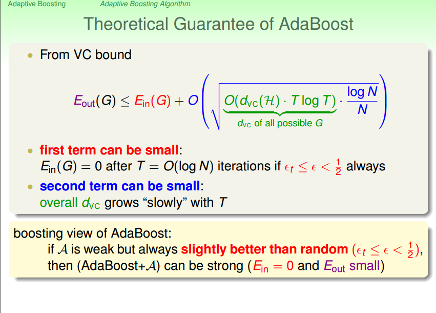

boost在理论上的意义是这样，如果我下面的演算法A很弱，对他的要求只有一点点，就是你要比乱猜好一点，只要他比乱猜好一点，我就可以通过这个演算法来让他越变越强，强到他的Ein=0,Eout很小。这样的性质叫做boosting，而AdaBoost是一个逐步地做到boosting效果的演算法。

# 4. Adaptive Boosting in Active

## 4.1 Decision Stump

我们之前说过，AdaBoost只要搭配一个很弱的演算法就好了，一个常用的选择就是DecisionStump.

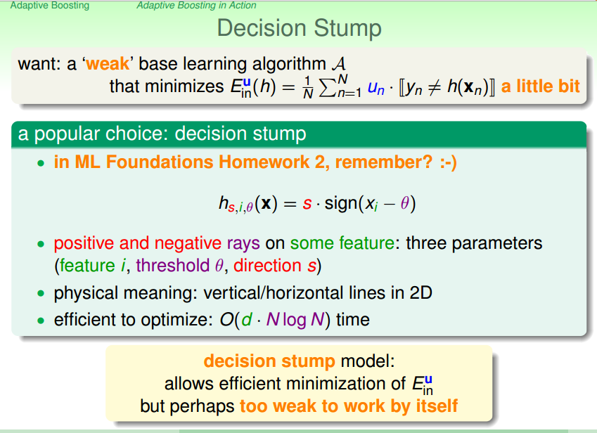

